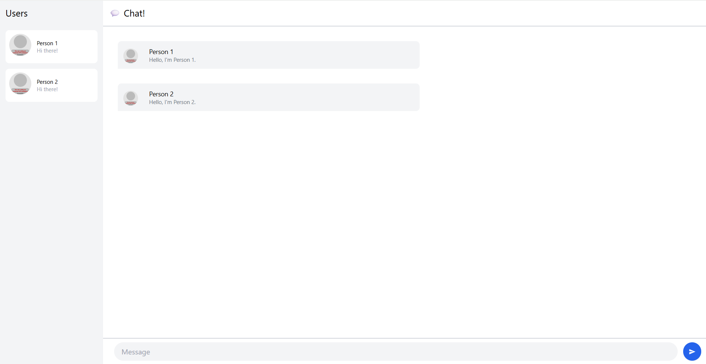

# Module 10, Tutorial 3
## 3.1 Original code

## 3.2 Add some creativities to the webclient

First, I made it so that you can also press enter while on the input field to send the message in addition to pressing the "Send" button. Second, I made it so that you can send multi-line messages (to add a new line, press Shift + Enter.) The textbox shows four lines, and if you add more than four lines, you have to scroll on the text box. In the app itself, I added `whitespace-pre-line` so that it displays any new line on the HTML code in the page itself. I also added the user's current username on the chat page itself, so that the top of the message says "Welcome to the Chat, \<username\>!". I also ensured that the message will not be sent if the user doesn't type anything (a.k.a. message is blank). I also added the message "Login to Chat" on the homepage.
